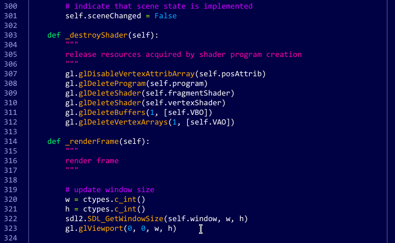
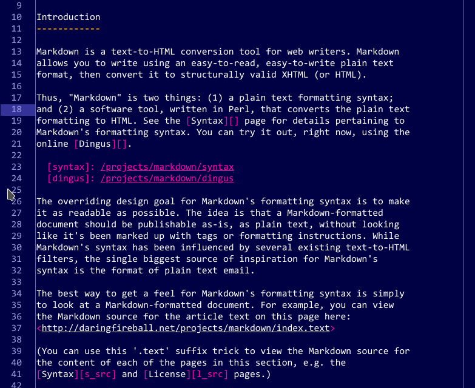
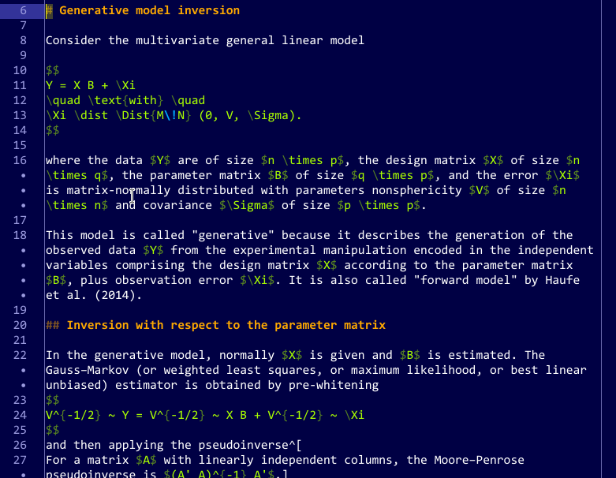

# Dark-blue Candy Store

This syntax theme for [Atom](https://atom.io/) has a dark blue background, and bright strong colors reminiscent of candy. Tastefully subdued shades have been overdone. It is time for some child-like joy!

The package supports the improved Markdown highlighting of [language-markdown](https://atom.io/packages/language-markdown).

## Examples

- Python:

- Markdown

- Pandoc-flavored Markdown with embedded LaTeX

***

Copyright © 2019 Carsten Allefeld, released under the MIT license.
